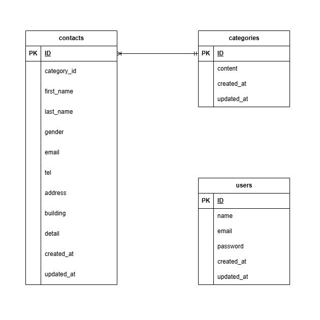

# アプリケーション名
お問い合わせフォーム

## 環境構築
### Dockerビルド
1.git clone
2.docker-compose up -d --build

*MySQLは、OSによって起動しない場合があるのでそれぞれのPCに合わせて docker-compose.yml ファイルを編集してください。

### Laravel環境構築
1.docker-compose exec php bash
2.composer install
3..env.exampleファイルから.envを作成し、環境変数を変更
4.php artisan key:generate
5.php artisan maigrate
6.php artisan db:seed

## 使用技術(実行環境)
- PHP 7.4.9
- Laravel 8.83.29
- MySQL 15.1
- Docker 28.0.1
- Docker Compose v2.33.1

## ER図
< - - - 作成したER図の画像 - - - >

## URL
- 開発環境：http://localhost/
- phpMyAdmin:http://localhost:8080/